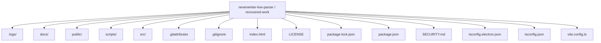
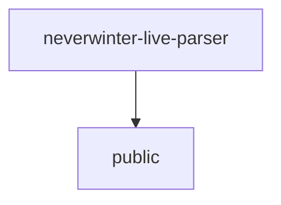
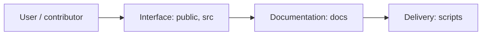
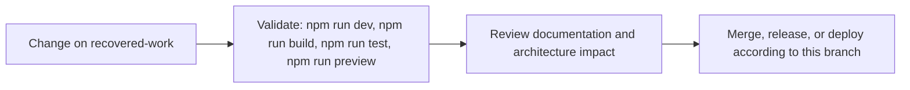

# Neverwinter Live Parser

<!-- interactive-readme-standard:start -->

> [!NOTE]
> **Branch-specific documentation:** this section is maintained for [`recovered-work`](https://github.com/Nischhalsubba/neverwinter-live-parser/tree/recovered-work). It is generated from the files present on this branch and preserves the project-authored README below.

<details open>
<summary><strong>Interactive repository guide</strong></summary>

## Branch overview

| Item | Value |
|---|---|
| Repository | [`Nischhalsubba/neverwinter-live-parser`](https://github.com/Nischhalsubba/neverwinter-live-parser) |
| Branch | [`recovered-work`](https://github.com/Nischhalsubba/neverwinter-live-parser/tree/recovered-work) |
| Detected stack | React, Vite, Electron, TypeScript, JavaScript, HTML, CSS |
| Detected manifests | package.json |
| Documentation policy | Every maintained branch must explain purpose, setup, structure, architecture, flows, testing, delivery, security, and ownership. |

## Repository structure



The diagram is generated from the branch's actual top-level files and directories. Use the branch link above for complete source navigation.

## Website or application structure



## Application and responsibility flow



## Change-to-delivery flow



## README requirements for this branch

- Explain what this branch contains and how it differs from the default branch.
- Keep installation, configuration, usage, testing, deployment, security, support, and license information accurate.
- Document repository, website or application, API, data, authentication, background-job, and deployment flows when they exist.
- Prefer Mermaid diagrams and expandable `<details>` sections for visual navigation.
- Link diagrams and modules to real source paths; never invent missing components.
- Preserve project-specific documentation and update diagrams whenever architecture or major paths change.
- Treat secrets, private infrastructure, customer data, and credentials as prohibited README content.

</details>

<!-- interactive-readme-standard:end -->

Neverwinter Live Parser is a Windows-first desktop application for real-time Neverwinter combat log tracking, encounter segmentation, session history, auxiliary log analysis, and post-run review.

The project is built as a local-first parser utility with three priorities:

- accurate combat-log ingestion
- readable encounter and party analytics
- fast desktop workflow for live tracking and recorded review

## Highlights

- Live monitoring of active `combatlog_YYYY-MM-DD_HH-MM-SS` files
- Boss-by-boss and pull-by-pull encounter segmentation
- Party overview for damage, healing, damage taken, timing, and artifact windows
- Recorded-log import for historical analysis
- Auxiliary log parsing for voice, client, lifecycle, and debug context
- Session archives and run history instead of disposable live state
- Windows desktop packaging for unpacked and portable releases

## Architecture

The codebase is now organized as a layered desktop application:

```text
src/
  desktop/
    runtime/
      main.ts
      preload.ts
      services/
  engine/
    aggregation/
    encounters/
    monitoring/
    parsing/
    reading/
    watching/
  shared/
    config/
    data/
    models/
  ui/
    app/
    metadata/
    shell/
    state/
    styles/
    types/
```

### Layer responsibilities

- `src/desktop/runtime`
  - Electron lifecycle, window creation, runtime hardening, IPC handlers, and diagnostics
- `src/engine`
  - Log reading, parsing, encounter segmentation, aggregation, live monitoring, and worker-based imports
- `src/shared`
  - Canonical cross-process types, constants, domain helpers, and curated Neverwinter datasets
- `src/ui`
  - React application bootstrap, renderer state projections, metadata resolution, shell screens, and desktop styling

## Code Tour

If you are new to the repo, start with these files first:

- [main.ts](c:/Users/acer/OneDrive/Documents/Projects/neverwinter-live-parser/src/desktop/runtime/main.ts)
  - Electron startup, IPC wiring, runtime protections, and desktop lifecycle
- [logMonitorService.ts](c:/Users/acer/OneDrive/Documents/Projects/neverwinter-live-parser/src/engine/monitoring/logMonitorService.ts)
  - the main service that coordinates log watching, parsing, encounter segmentation, recording, and state emission
- [parseLine.ts](c:/Users/acer/OneDrive/Documents/Projects/neverwinter-live-parser/src/engine/parsing/parseLine.ts)
  - core Neverwinter combat-line parser
- [parseAuxiliaryLogLine.ts](c:/Users/acer/OneDrive/Documents/Projects/neverwinter-live-parser/src/engine/parsing/parseAuxiliaryLogLine.ts)
  - parser for auxiliary Neverwinter logs such as voice, lifecycle, and client events
- [App.tsx](c:/Users/acer/OneDrive/Documents/Projects/neverwinter-live-parser/src/ui/app/App.tsx)
  - renderer bootstrap and high-level state subscription root
- [ObsidianScreens.tsx](c:/Users/acer/OneDrive/Documents/Projects/neverwinter-live-parser/src/ui/shell/ObsidianScreens.tsx)
  - main desktop shell and primary screen composition layer
- [analysisViewModel.ts](c:/Users/acer/OneDrive/Documents/Projects/neverwinter-live-parser/src/ui/state/analysisViewModel.ts)
  - renderer-side projections that turn raw snapshots into sortable, drillable UI rows

## Development Standards

The repo is structured around a few rules:

- parser and aggregation logic stay out of renderer views
- cross-process contracts live in `src/shared/models`
- Electron-only code stays in `src/desktop/runtime`
- UI projections belong in `src/ui/state`
- repository automation lives in `scripts`
- generated artifacts and local investigation files do not belong in the repo root

Most hand-authored source files now start with a short purpose comment so the next developer can understand what the file owns before reading implementation details.

## Maintenance Workflow

- Keep Electron-only code in `src/desktop/runtime`
- Keep parser and aggregation code in `src/engine`
- Keep cross-process contracts in `src/shared/models`
- Keep renderer-only projections in `src/ui/state`
- Keep visual metadata lookup in `src/ui/metadata`
- Update [docs/project-fixes-log.md](./docs/project-fixes-log.md) for every meaningful code, config, UI, or docs change

For a more operational maintenance map, see [docs/maintainer-guide.md](./docs/maintainer-guide.md).

## Tech Stack

- Electron
- React
- TypeScript
- Recharts
- Vite
- Vitest

## Local Development

```powershell
npm install
npm run dev
```

## Verification

```powershell
npm test
npm run build
```

## Windows Builds

### Fast local desktop build

```powershell
npm run dist:win-unpacked
```

Launch:

`release/win-unpacked/Neverwinter Live Parser.exe`

### Portable build

```powershell
npm run dist:win-portable
```

Portable output:

`release/Neverwinter-Live-Parser-Portable-<version>.exe`

## Security and Privacy

- The application works against local Neverwinter logs on the user machine.
- Runtime activity and error logs are stored locally for debugging.
- Packaged builds block unexpected outbound navigation and permission requests.
- Public distribution still benefits from proper Windows code signing.

See [SECURITY.md](./SECURITY.md) for the current runtime hardening notes.

## Documentation

- [SECURITY.md](./SECURITY.md)
- [docs/project-fixes-log.md](./docs/project-fixes-log.md)

## Maintainer

**Nischhal Raj Subba**

This repository represents an ongoing effort to build a polished, practical, and accurate Neverwinter combat parser for real-world dungeon, trial, and arena play.
