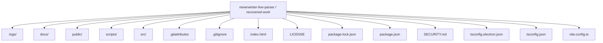
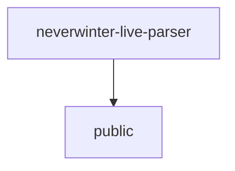
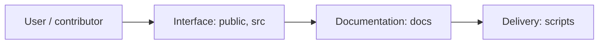
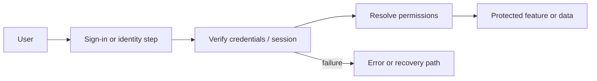
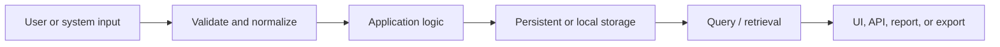
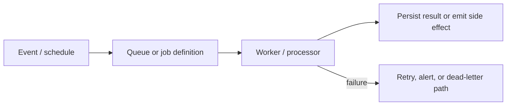
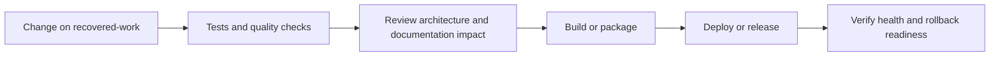
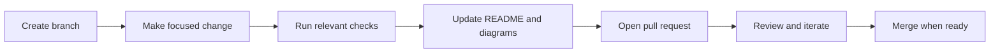

<!-- interactive-readme-standard:start -->

<div align="center">

# neverwinter-live-parser

**Branch-aware technical guide for [`recovered-work`](https://github.com/Nischhalsubba/neverwinter-live-parser/tree/recovered-work)**

<p>        </p>

<p>
  <a href="https://github.com/Nischhalsubba/neverwinter-live-parser/tree/recovered-work"><strong>Browse source</strong></a> ·
  <a href="https://github.com/Nischhalsubba/neverwinter-live-parser/issues"><strong>Issues</strong></a> ·
  <a href="https://github.com/Nischhalsubba/neverwinter-live-parser/codespaces/new?ref=recovered-work"><strong>Open in Codespaces</strong></a>
</p>

</div>

> [!IMPORTANT]
> This guide is generated from the files actually present on `recovered-work`. It links to detected source paths, preserves project-authored notes, and avoids claiming components that were not found.

## At a glance

| Item | Detected value |
|---|---|
| Purpose | Windows-only local Neverwinter combat log parser with a minimal Electron dashboard. |
| Branch role | Compared with `main` |
| Stack | React, Vite, Electron, TypeScript, JavaScript, HTML, CSS |
| Manifests | package.json |
| Prerequisites | Node.js |
| Delivery | No conventional deployment configuration detected |
| License | LICENSE |

## Branch scope

No branch-specific file differences were detected against the default branch at generation time.


## Quick start

```bash
npm install
npm run dev
npm run build
npm run test
npm run preview
```

### Configuration surface

- No committed environment example file was detected.

> Never commit secrets, private keys, production credentials, customer data, or unredacted infrastructure details.

## Repository map



| Responsibility | Detected source paths |
|---|---|
| Interface | [`public`](https://github.com/Nischhalsubba/neverwinter-live-parser/tree/recovered-work/public), [`src`](https://github.com/Nischhalsubba/neverwinter-live-parser/tree/recovered-work/src) |
| Documentation | [`docs`](https://github.com/Nischhalsubba/neverwinter-live-parser/tree/recovered-work/docs) |
| Delivery | [`scripts`](https://github.com/Nischhalsubba/neverwinter-live-parser/tree/recovered-work/scripts) |

## Website or application map



## Architecture and responsibility flow



<details>
<summary><strong>Authentication and authorization flow</strong></summary>



Relevant detected files: [`public/nw-hub/artifacts/lostmauths_horn_of_blasting.webp`](https://github.com/Nischhalsubba/neverwinter-live-parser/blob/recovered-work/public/nw-hub/artifacts/lostmauths_horn_of_blasting.webp).

> The diagram expresses the responsibility sequence only. Confirm exact providers, token formats, roles, and recovery behavior in the linked source.

</details>
<details>
<summary><strong>Data flow and model surface</strong></summary>



Detected data areas: [`src/shared/models/nwHubArtifacts.ts`](https://github.com/Nischhalsubba/neverwinter-live-parser/blob/recovered-work/src/shared/models/nwHubArtifacts.ts), [`src/shared/models/auxiliaryLogs.ts`](https://github.com/Nischhalsubba/neverwinter-live-parser/blob/recovered-work/src/shared/models/auxiliaryLogs.ts), [`src/shared/models/mechanicsModel.ts`](https://github.com/Nischhalsubba/neverwinter-live-parser/blob/recovered-work/src/shared/models/mechanicsModel.ts), [`src/shared/models/types.ts`](https://github.com/Nischhalsubba/neverwinter-live-parser/blob/recovered-work/src/shared/models/types.ts).

</details>
<details>
<summary><strong>Background jobs and scheduled work</strong></summary>



Relevant detected files: [`src/engine/monitoring/importWorker.ts`](https://github.com/Nischhalsubba/neverwinter-live-parser/blob/recovered-work/src/engine/monitoring/importWorker.ts).

</details>

## Quality, security, and operations

<table>
<tr>
<td width="33%" valign="top">

### Quality

- No conventional test directory was detected automatically.

Detected commands:
- `npm run dev`
- `npm run build`
- `npm run test`
- `npm run preview`

</td>
<td width="33%" valign="top">

### Security

- [`SECURITY.md`](https://github.com/Nischhalsubba/neverwinter-live-parser/blob/recovered-work/SECURITY.md)

Review authentication, authorization, input validation, dependency updates, secret handling, and failure recovery before release.

</td>
<td width="34%" valign="top">

### Observability

- [`src/desktop/runtime/services/errorLogger.ts`](https://github.com/Nischhalsubba/neverwinter-live-parser/blob/recovered-work/src/desktop/runtime/services/errorLogger.ts)

Define useful logs, metrics, traces, alerts, and rollback signals for production-facing branches.

</td>
</tr>
</table>

## Delivery flow



### Automation detected

- No GitHub Actions workflow files were detected.

## Contribution flow



- Keep changes focused and explain architectural consequences.
- Run the checks relevant to the changed area.
- Update diagrams whenever routes, modules, data models, authentication, jobs, or delivery paths change.
- Add screenshots or recordings for visual behavior changes when useful.
- Use issues for reproducible defects and pull requests for reviewable changes.

## Ownership and support

| Topic | Source |
|---|---|
| Repository | [`Nischhalsubba/neverwinter-live-parser`](https://github.com/Nischhalsubba/neverwinter-live-parser) |
| Branch | [`recovered-work`](https://github.com/Nischhalsubba/neverwinter-live-parser/tree/recovered-work) |
| Ownership | No CODEOWNERS file detected |
| Contributing | Use the contribution flow above |
| Support | [Open or review issues](https://github.com/Nischhalsubba/neverwinter-live-parser/issues) |
| License | [`LICENSE`](https://github.com/Nischhalsubba/neverwinter-live-parser/blob/recovered-work/LICENSE) |

<details>
<summary><strong>Documentation maintenance checklist</strong></summary>

- [ ] Purpose and branch scope are accurate.
- [ ] Setup and configuration commands still work.
- [ ] Repository, application, API, data, authentication, job, and deployment diagrams match the code.
- [ ] Tests, security controls, observability, and rollback behavior are documented.
- [ ] Links point to real files on this branch.
- [ ] No secrets or private operational details are exposed.

</details>

<!-- interactive-readme-standard:end -->

<!-- project-authored-notes:start -->
<details>
<summary><strong>Project-authored notes preserved from this branch</strong></summary>

# Neverwinter Live Parser

Neverwinter Live Parser is a Windows-first desktop application for real-time Neverwinter combat log tracking, encounter segmentation, session history, auxiliary log analysis, and post-run review.

The project is built as a local-first parser utility with three priorities:

- accurate combat-log ingestion
- readable encounter and party analytics
- fast desktop workflow for live tracking and recorded review

## Highlights

- Live monitoring of active `combatlog_YYYY-MM-DD_HH-MM-SS` files
- Boss-by-boss and pull-by-pull encounter segmentation
- Party overview for damage, healing, damage taken, timing, and artifact windows
- Recorded-log import for historical analysis
- Auxiliary log parsing for voice, client, lifecycle, and debug context
- Session archives and run history instead of disposable live state
- Windows desktop packaging for unpacked and portable releases

## Architecture

The codebase is now organized as a layered desktop application:

```text
src/
  desktop/
    runtime/
      main.ts
      preload.ts
      services/
  engine/
    aggregation/
    encounters/
    monitoring/
    parsing/
    reading/
    watching/
  shared/
    config/
    data/
    models/
  ui/
    app/
    metadata/
    shell/
    state/
    styles/
    types/
```

### Layer responsibilities

- `src/desktop/runtime`
  - Electron lifecycle, window creation, runtime hardening, IPC handlers, and diagnostics
- `src/engine`
  - Log reading, parsing, encounter segmentation, aggregation, live monitoring, and worker-based imports
- `src/shared`
  - Canonical cross-process types, constants, domain helpers, and curated Neverwinter datasets
- `src/ui`
  - React application bootstrap, renderer state projections, metadata resolution, shell screens, and desktop styling

## Code Tour

If you are new to the repo, start with these files first:

- [main.ts](c:/Users/acer/OneDrive/Documents/Projects/neverwinter-live-parser/src/desktop/runtime/main.ts)
  - Electron startup, IPC wiring, runtime protections, and desktop lifecycle
- [logMonitorService.ts](c:/Users/acer/OneDrive/Documents/Projects/neverwinter-live-parser/src/engine/monitoring/logMonitorService.ts)
  - the main service that coordinates log watching, parsing, encounter segmentation, recording, and state emission
- [parseLine.ts](c:/Users/acer/OneDrive/Documents/Projects/neverwinter-live-parser/src/engine/parsing/parseLine.ts)
  - core Neverwinter combat-line parser
- [parseAuxiliaryLogLine.ts](c:/Users/acer/OneDrive/Documents/Projects/neverwinter-live-parser/src/engine/parsing/parseAuxiliaryLogLine.ts)
  - parser for auxiliary Neverwinter logs such as voice, lifecycle, and client events
- [App.tsx](c:/Users/acer/OneDrive/Documents/Projects/neverwinter-live-parser/src/ui/app/App.tsx)
  - renderer bootstrap and high-level state subscription root
- [ObsidianScreens.tsx](c:/Users/acer/OneDrive/Documents/Projects/neverwinter-live-parser/src/ui/shell/ObsidianScreens.tsx)
  - main desktop shell and primary screen composition layer
- [analysisViewModel.ts](c:/Users/acer/OneDrive/Documents/Projects/neverwinter-live-parser/src/ui/state/analysisViewModel.ts)
  - renderer-side projections that turn raw snapshots into sortable, drillable UI rows

## Development Standards

The repo is structured around a few rules:

- parser and aggregation logic stay out of renderer views
- cross-process contracts live in `src/shared/models`
- Electron-only code stays in `src/desktop/runtime`
- UI projections belong in `src/ui/state`
- repository automation lives in `scripts`
- generated artifacts and local investigation files do not belong in the repo root

Most hand-authored source files now start with a short purpose comment so the next developer can understand what the file owns before reading implementation details.

## Maintenance Workflow

- Keep Electron-only code in `src/desktop/runtime`
- Keep parser and aggregation code in `src/engine`
- Keep cross-process contracts in `src/shared/models`
- Keep renderer-only projections in `src/ui/state`
- Keep visual metadata lookup in `src/ui/metadata`
- Update [docs/project-fixes-log.md](./docs/project-fixes-log.md) for every meaningful code, config, UI, or docs change

For a more operational maintenance map, see [docs/maintainer-guide.md](./docs/maintainer-guide.md).

## Tech Stack

- Electron
- React
- TypeScript
- Recharts
- Vite
- Vitest

## Local Development

```powershell
npm install
npm run dev
```

## Verification

```powershell
npm test
npm run build
```

## Windows Builds

### Fast local desktop build

```powershell
npm run dist:win-unpacked
```

Launch:

`release/win-unpacked/Neverwinter Live Parser.exe`

### Portable build

```powershell
npm run dist:win-portable
```

Portable output:

`release/Neverwinter-Live-Parser-Portable-<version>.exe`

## Security and Privacy

- The application works against local Neverwinter logs on the user machine.
- Runtime activity and error logs are stored locally for debugging.
- Packaged builds block unexpected outbound navigation and permission requests.
- Public distribution still benefits from proper Windows code signing.

See [SECURITY.md](./SECURITY.md) for the current runtime hardening notes.

## Documentation

- [SECURITY.md](./SECURITY.md)
- [docs/project-fixes-log.md](./docs/project-fixes-log.md)

## Maintainer

**Nischhal Raj Subba**

This repository represents an ongoing effort to build a polished, practical, and accurate Neverwinter combat parser for real-world dungeon, trial, and arena play.

</details>
<!-- project-authored-notes:end -->
