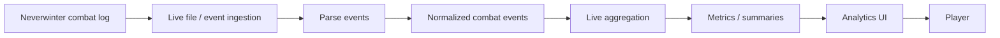
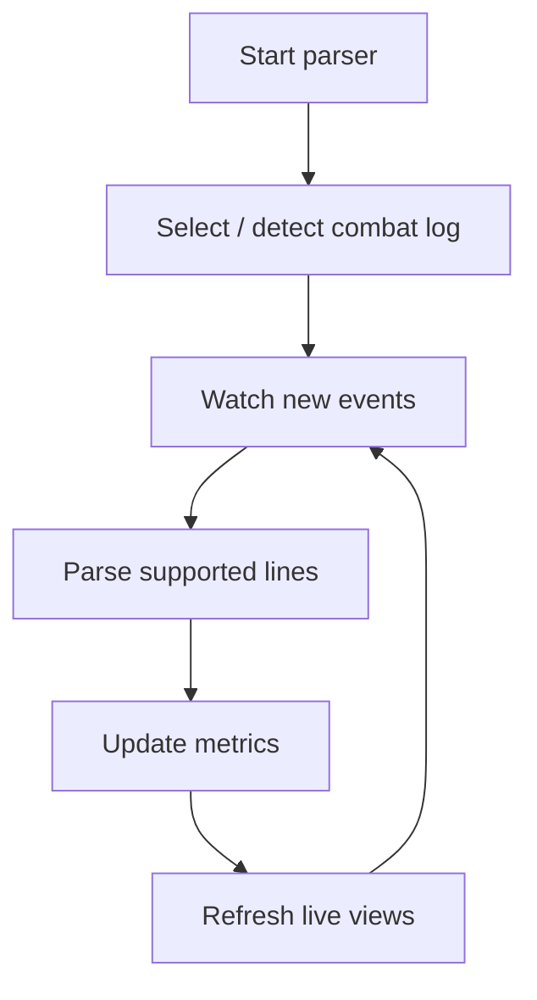
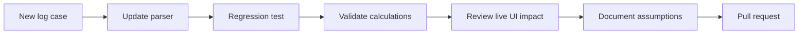

<div align="center">

# Neverwinter Live Parser

**A live combat analytics experience that translates dense Neverwinter combat-log data into signals, summaries, and views players can interpret quickly.**


[Browse source](https://github.com/Nischhalsubba/neverwinter-live-parser/tree/main) · [Issues](https://github.com/Nischhalsubba/neverwinter-live-parser/issues)

</div>

## Overview

**Neverwinter Live Parser** turns a stream of combat-log events into structured analysis. The design problem is not merely parsing text; it is helping a player understand what matters while events continue to arrive.

| Audience | Focus |
|---|---|
| Players / analysts | Real-time combat signals and readable summaries |
| Developers | File/log ingestion, parsing, aggregation and state updates |
| Designers | High-density live data, filtering, hierarchy and temporal feedback |
| Maintainers | Event formats, regression samples, game versions and calculation assumptions |

<details open>
<summary><strong>🏗️ Interactive live-parser architecture</strong></summary>



</details>

## Live analysis flow



## Getting started

```bash
git clone https://github.com/Nischhalsubba/neverwinter-live-parser.git
cd neverwinter-live-parser
```

Use the manifests and lockfiles committed in the repository to determine the current runtime, build, and test commands.

## Product & design principles

Live analytics should distinguish current encounters from historical context, tolerate malformed/unknown events, avoid silently dropping important parsing failures, and show data freshness. Keep dense views scannable with stable columns, sensible defaults, keyboard access, readable contrast, and explanations for derived metrics.

## SEO & discoverability

Use accurate terms such as **Neverwinter live parser, Neverwinter combat parser, combat log analysis, DPS analysis, combat analytics, and Neverwinter tools** only where supported by implemented behavior and documented calculations.

## Contribution flow


