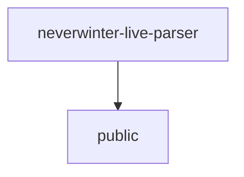
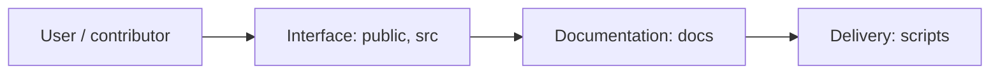
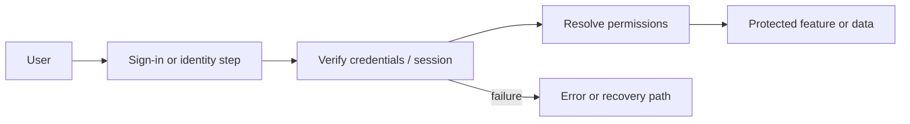
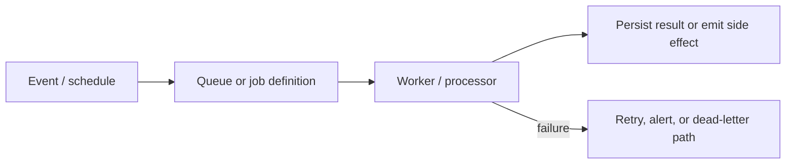
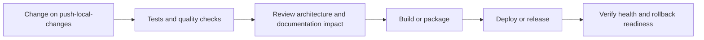
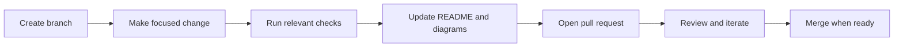

<!-- interactive-readme-standard:start -->

<div align="center">

# neverwinter-live-parser

**Branch-aware technical guide for [`push-local-changes`](https://github.com/Nischhalsubba/neverwinter-live-parser/tree/push-local-changes)**

<p>        </p>

<p>
  <a href="https://github.com/Nischhalsubba/neverwinter-live-parser/tree/push-local-changes"><strong>Browse source</strong></a> ·
  <a href="https://github.com/Nischhalsubba/neverwinter-live-parser/issues"><strong>Issues</strong></a> ·
  <a href="https://github.com/Nischhalsubba/neverwinter-live-parser/codespaces/new?ref=push-local-changes"><strong>Open in Codespaces</strong></a>
</p>

</div>

> [!IMPORTANT]
> This guide is generated from the files actually present on `push-local-changes`. It links to detected source paths, preserves project-authored notes, and avoids claiming components that were not found.

## At a glance

| Item | Detected value |
|---|---|
| Purpose | Windows-only local Neverwinter combat log parser with a minimal Electron dashboard. |
| Branch role | Compared with `main` |
| Stack | React, Vite, Electron, TypeScript, JavaScript, HTML, CSS |
| Manifests | package.json |
| Prerequisites | Node.js |
| Delivery | No conventional deployment configuration detected |
| License | LICENSE |

## Branch scope

This branch differs from the default branch in the following detected paths:

- [`README.md`](https://github.com/Nischhalsubba/neverwinter-live-parser/blob/push-local-changes/README.md)

## Quick start

```bash
npm install
npm run dev
npm run build
npm run test
npm run preview
```

### Configuration surface

- No committed environment example file was detected.

> Never commit secrets, private keys, production credentials, customer data, or unredacted infrastructure details.

## Repository map

```mermaid
flowchart TD
    ROOT["neverwinter-live-parser / push-local-changes"]
    ROOT --> P0[".logs/"]
    ROOT --> P1[".tmp-electron-app/"]
    ROOT --> P2[".tmp-electron-app2/"]
    ROOT --> P3["docs/"]
    ROOT --> P4["public/"]
    ROOT --> P5["scripts/"]
    ROOT --> P6["src/"]
    ROOT --> P7[".gitignore"]
    ROOT --> P8[".tmp-argv.mjs"]
    ROOT --> P9[".tmp-chokidar.mjs"]
    ROOT --> P10[".tmp-electron-main.cjs"]
    ROOT --> P11[".tmp-electron-named.mjs"]
    ROOT --> P12[".tmp-electron-require.cjs"]
    ROOT --> P13[".tmp-electron-require.mjs"]
    ROOT --> P14[".tmp-electron-test.mjs"]
    ROOT --> P15[".tmp-import-app.mjs"]
    ROOT --> P16[".tmp-package.json"]
    ROOT --> P17[".tmp-plain.mjs"]
    ROOT --> MORE["+ 28 more top-level entries"]
```



| Responsibility | Detected source paths |
|---|---|
| Interface | [`public`](https://github.com/Nischhalsubba/neverwinter-live-parser/tree/push-local-changes/public), [`src`](https://github.com/Nischhalsubba/neverwinter-live-parser/tree/push-local-changes/src) |
| Documentation | [`docs`](https://github.com/Nischhalsubba/neverwinter-live-parser/tree/push-local-changes/docs) |
| Delivery | [`scripts`](https://github.com/Nischhalsubba/neverwinter-live-parser/tree/push-local-changes/scripts) |

## Website or application map



## Architecture and responsibility flow



<details>
<summary><strong>Authentication and authorization flow</strong></summary>



Relevant detected files: [`public/nw-hub/artifacts/lostmauths_horn_of_blasting.webp`](https://github.com/Nischhalsubba/neverwinter-live-parser/blob/push-local-changes/public/nw-hub/artifacts/lostmauths_horn_of_blasting.webp).

> The diagram expresses the responsibility sequence only. Confirm exact providers, token formats, roles, and recovery behavior in the linked source.

</details>
<details>
<summary><strong>Background jobs and scheduled work</strong></summary>



Relevant detected files: [`src/core/monitoring/importWorker.ts`](https://github.com/Nischhalsubba/neverwinter-live-parser/blob/push-local-changes/src/core/monitoring/importWorker.ts).

</details>

## Quality, security, and operations

<table>
<tr>
<td width="33%" valign="top">

### Quality

- No conventional test directory was detected automatically.

Detected commands:
- `npm run dev`
- `npm run build`
- `npm run test`
- `npm run preview`

</td>
<td width="33%" valign="top">

### Security

- [`SECURITY.md`](https://github.com/Nischhalsubba/neverwinter-live-parser/blob/push-local-changes/SECURITY.md)

Review authentication, authorization, input validation, dependency updates, secret handling, and failure recovery before release.

</td>
<td width="34%" valign="top">

### Observability

- [`src/main/errorLogger.ts`](https://github.com/Nischhalsubba/neverwinter-live-parser/blob/push-local-changes/src/main/errorLogger.ts)

Define useful logs, metrics, traces, alerts, and rollback signals for production-facing branches.

</td>
</tr>
</table>

## Delivery flow



### Automation detected

- No GitHub Actions workflow files were detected.

## Contribution flow



- Keep changes focused and explain architectural consequences.
- Run the checks relevant to the changed area.
- Update diagrams whenever routes, modules, data models, authentication, jobs, or delivery paths change.
- Add screenshots or recordings for visual behavior changes when useful.
- Use issues for reproducible defects and pull requests for reviewable changes.

## Ownership and support

| Topic | Source |
|---|---|
| Repository | [`Nischhalsubba/neverwinter-live-parser`](https://github.com/Nischhalsubba/neverwinter-live-parser) |
| Branch | [`push-local-changes`](https://github.com/Nischhalsubba/neverwinter-live-parser/tree/push-local-changes) |
| Ownership | No CODEOWNERS file detected |
| Contributing | Use the contribution flow above |
| Support | [Open or review issues](https://github.com/Nischhalsubba/neverwinter-live-parser/issues) |
| License | [`LICENSE`](https://github.com/Nischhalsubba/neverwinter-live-parser/blob/push-local-changes/LICENSE) |

<details>
<summary><strong>Documentation maintenance checklist</strong></summary>

- [ ] Purpose and branch scope are accurate.
- [ ] Setup and configuration commands still work.
- [ ] Repository, application, API, data, authentication, job, and deployment diagrams match the code.
- [ ] Tests, security controls, observability, and rollback behavior are documented.
- [ ] Links point to real files on this branch.
- [ ] No secrets or private operational details are exposed.

</details>

<!-- interactive-readme-standard:end -->

<!-- project-authored-notes:start -->
<details>
<summary><strong>Project-authored notes preserved from this branch</strong></summary>

# Neverwinter Live Parser

Neverwinter Live Parser is a Windows desktop application for reading Neverwinter combat logs in real time, preserving session history, and breaking down player performance across bosses, trash pulls, dungeon runs, and recorded log files.

Built as a local-first desktop utility, the project focuses on three things:

- accurate Neverwinter combat log parsing
- readable encounter and party analysis
- fast Windows-first workflow for live tracking and post-run review

## What This Project Does

This repository powers a dedicated **Neverwinter combat log parser**, **DPS tracker**, and **encounter analysis tool** for Windows players who want more control over:

- live combat tracking
- party overview and damage breakdowns
- healing, damage taken, support, and artifact windows
- boss-by-boss encounter review
- recorded combat log analysis
- organized session and run history
- auxiliary game-log context such as voice, client, and lifecycle events

The goal is to make Neverwinter combat data easier to understand without forcing players into a browser workflow or a web dashboard mindset. This project is designed as a true desktop parser utility.

## Core Features

### Live Neverwinter Combat Log Tracking

- Follow the active `combatlog_YYYY-MM-DD_HH-MM-SS` file in real time
- Watch live combat table updates for damage, healing, damage taken, and support
- Track active session scope or switch into specific encounter scope
- Capture and preserve run history while continuing to monitor new logs

### Encounter Breakdown and Session Review

- Review encounter-by-encounter performance across a full dungeon or trial
- Separate boss fights and trash pulls into readable segments
- Compare party output by player, power, target, hit, artifact, and timing
- Preserve archived sessions so past combat logs do not disappear when a new log starts

### Recorded Log Analysis

- Import older Neverwinter combat logs for post-run review
- Keep archived sessions and recordings organized in history
- Inspect party contribution, top powers, target focus, large hits, and detailed player breakdowns

### Auxiliary Neverwinter Log Awareness

- Parse supporting Neverwinter log types beyond the main combat log
- Preserve more context around runs, sessions, and system activity
- Surface operational and debug context to help diagnose tracking problems

## Why This Repo Matters

Most Neverwinter players who want combat insight need something more detailed than a simple DPS number. This project is built to give a fuller view of what happened in a run:

- who dealt the most damage
- who carried healing or support
- which powers actually contributed
- how the run changed from first boss to last boss
- what happened between combat pulls
- what was recorded and why

The intention is not just to show stats, but to make those stats understandable.

## Tech Stack

- Electron
- React
- TypeScript
- Recharts
- Vite

## Windows Build and Usage

### Local Development

```powershell
npm install
npm run dev
```

### Production Build

```powershell
npm run build
```

### Recommended Windows Release Build

For the fastest startup and best day-to-day usability on Windows, generate the unpacked desktop build:

```powershell
npm run dist:win-unpacked
```

Launch it from:

`release/win-unpacked/Neverwinter Live Parser.exe`

### Single-File Portable Build

If you specifically need a single-file output:

```powershell
npm run dist:win-portable
```

Portable output path:

`release/Neverwinter-Live-Parser-Portable-0.1.0.exe`

The unpacked build is the preferred release format when startup responsiveness matters most.

## Project Goals

- Make live Neverwinter combat tracking reliable
- Keep analysis readable for solo players and endgame groups
- Preserve useful history instead of losing old sessions
- Keep the desktop UX fast, focused, and practical
- Improve parser quality, diagnostics, and release stability over time

## Privacy and Security

- The app is built to read local Neverwinter log files on the user’s machine.
- Error and activity logs are stored locally for debugging.
- Automatic outbound web requests are blocked in the packaged runtime.
- Unsigned local Windows builds can still trigger Smart App Control or SmartScreen warnings. Public distribution requires code signing to reduce those warnings.

For the current runtime hardening and security notes, see [SECURITY.md](./SECURITY.md).

## Maintainer

**Nischhal Raj Subba**

This repository represents an ongoing effort to build a polished, high-signal Neverwinter combat parser focused on practical real-world use during live play and post-run analysis.

</details>
<!-- project-authored-notes:end -->
