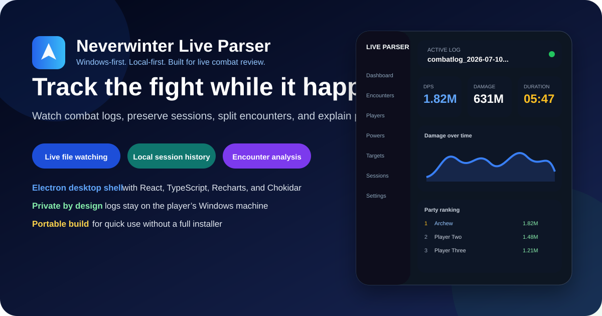
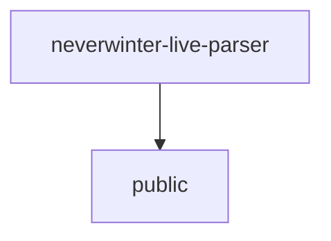
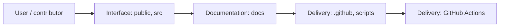
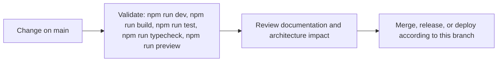
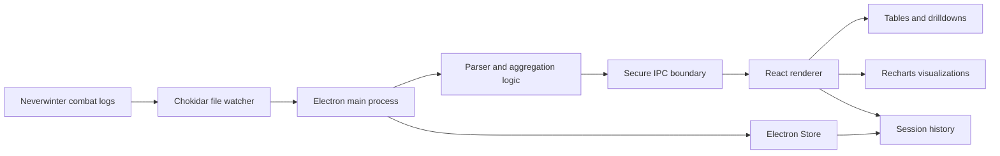
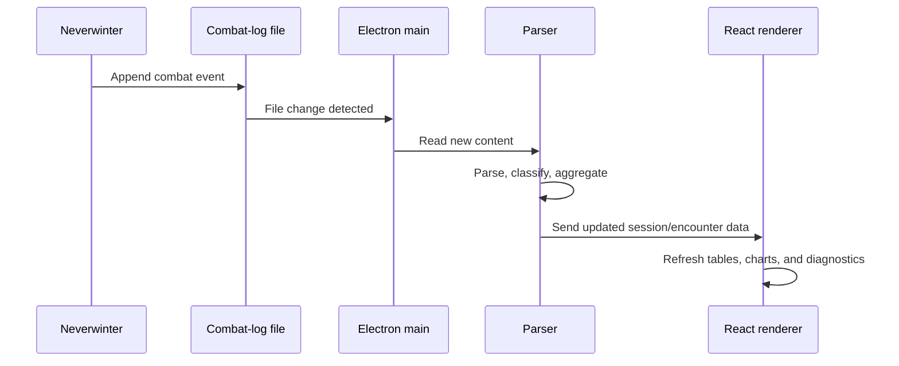

<div align="center">



# Neverwinter Live Parser

<!-- interactive-readme-standard:start -->

> [!NOTE]
> **Branch-specific documentation:** this section is maintained for [`main`](https://github.com/Nischhalsubba/neverwinter-live-parser/tree/main). It is generated from the files present on this branch and preserves the project-authored README below.

<details open>
<summary><strong>Interactive repository guide</strong></summary>

## Branch overview

| Item | Value |
|---|---|
| Repository | [`Nischhalsubba/neverwinter-live-parser`](https://github.com/Nischhalsubba/neverwinter-live-parser) |
| Branch | [`main`](https://github.com/Nischhalsubba/neverwinter-live-parser/tree/main) |
| Detected stack | React, Vite, Electron, TypeScript, JavaScript, HTML, CSS |
| Detected manifests | package.json |
| Documentation policy | Every maintained branch must explain purpose, setup, structure, architecture, flows, testing, delivery, security, and ownership. |

## Repository structure

```mermaid
flowchart TD
    ROOT["neverwinter-live-parser / main"]
    ROOT --> P0[".github/"]
    ROOT --> P1[".logs/"]
    ROOT --> P2[".tmp-electron-app/"]
    ROOT --> P3[".tmp-electron-app2/"]
    ROOT --> P4["docs/"]
    ROOT --> P5["public/"]
    ROOT --> P6["scripts/"]
    ROOT --> P7["src/"]
    ROOT --> P8[".gitignore"]
    ROOT --> P9[".tmp-argv.mjs"]
    ROOT --> P10[".tmp-chokidar.mjs"]
    ROOT --> P11[".tmp-electron-main.cjs"]
    ROOT --> P12[".tmp-electron-named.mjs"]
    ROOT --> P13[".tmp-electron-require.cjs"]
    ROOT --> P14[".tmp-electron-require.mjs"]
    ROOT --> P15[".tmp-electron-test.mjs"]
    ROOT --> P16[".tmp-import-app.mjs"]
    ROOT --> P17[".tmp-package.json"]
    ROOT --> MORE["+ 29 more top-level entries"]
```



The diagram is generated from the branch's actual top-level files and directories. Use the branch link above for complete source navigation.

## Website or application structure



## Application and responsibility flow



## Change-to-delivery flow



## README requirements for this branch

- Explain what this branch contains and how it differs from the default branch.
- Keep installation, configuration, usage, testing, deployment, security, support, and license information accurate.
- Document repository, website or application, API, data, authentication, background-job, and deployment flows when they exist.
- Prefer Mermaid diagrams and expandable `<details>` sections for visual navigation.
- Link diagrams and modules to real source paths; never invent missing components.
- Preserve project-specific documentation and update diagrams whenever architecture or major paths change.
- Treat secrets, private infrastructure, customer data, and credentials as prohibited README content.

</details>

<!-- interactive-readme-standard:end -->

### A Windows-first, local-first desktop combat log parser for live tracking, encounter analysis, session history, and post-run review.

<p>
  
  
  
  
  
  
</p>

[Overview](#overview) · [Features](#features) · [Architecture](#architecture) · [Development](#development) · [Windows builds](#windows-builds) · [Privacy](#privacy-and-security) · [Roadmap](#roadmap)

</div>

---

> [!NOTE]
> This is an active desktop-parser project. The repository contains a real Electron/React application, build scripts, tests, Windows packaging, live file watching, local persistence, and data-extraction utilities. Parser output should still be validated against representative Neverwinter combat logs before being treated as authoritative.

## Overview

**Neverwinter Live Parser** is a Windows desktop utility that watches Neverwinter combat logs, parses combat events, organizes them into sessions and encounters, and presents the results through a focused analytical interface.

The app is designed for two connected workflows:

1. **Live tracking** while a player is actively running content.
2. **Post-run review** of current or previously recorded combat logs.

Unlike an upload-first website, the parser is built around local Windows files and a desktop runtime. The application can follow the active combat-log file, preserve session context, expose player and encounter summaries, and package as an unpacked or portable Windows application.

### Product goals

- Keep combat data on the player’s machine.
- Detect and follow active combat logs reliably.
- Preserve previous sessions when new log files appear.
- Separate useful encounter scopes where possible.
- Make party, player, power, target, healing, support, and damage-taken analysis understandable.
- Surface uncertainty instead of silently inventing confident numbers.
- Offer a workflow that feels like a real desktop tool rather than a spreadsheet wearing fantasy armor.

## Why this project exists

Raw combat logs contain more information than a single DPS result can communicate. Players often need to answer questions such as:

- Who contributed the most damage during a specific encounter?
- Which powers produced that damage?
- Which targets received the most attention?
- How much healing or damage taken occurred?
- Did performance change between boss phases or pulls?
- Was a companion, artifact, or support effect responsible for part of the output?
- Did the parser miss events when a new combat-log file was created?
- Can an older run be reviewed without replaying the content?

The project exists to make those questions easier to investigate during and after play.

## Features

<table>
  <tr>
    <td width="50%" valign="top">
      <h3>Live file watching</h3>
      <p>Uses a Windows desktop runtime and Chokidar to follow active Neverwinter combat logs as they change.</p>
    </td>
    <td width="50%" valign="top">
      <h3>Session preservation</h3>
      <p>Keeps older session context available when a new combat-log file is created or selected.</p>
    </td>
  </tr>
  <tr>
    <td width="50%" valign="top">
      <h3>Encounter analysis</h3>
      <p>Organizes parsed data into useful scopes for bosses, pulls, dungeons, trials, and broader sessions where the log supports it.</p>
    </td>
    <td width="50%" valign="top">
      <h3>Local desktop workflow</h3>
      <p>Packages as a Windows unpacked application or portable executable without requiring combat-log uploads.</p>
    </td>
  </tr>
</table>

### Live tracking

- Watches active `combatlog_YYYY-MM-DD_HH-MM-SS` files.
- Follows file growth during gameplay.
- Detects newly created combat logs.
- Maintains session-level and encounter-level scopes.
- Supports diagnostics when the expected log path or file is unavailable.
- Uses the Electron main process for file-system access rather than exposing direct file access to the renderer.

### Analysis direction

The project is structured to support:

- total damage and DPS
- healing and damage taken
- player and party rankings
- power contribution
- target focus
- encounter timelines
- support, artifact, buff, and debuff windows
- companion and pet events
- recorded log review
- session history
- parser diagnostics and unknown-event handling

### Recorded logs

The parser is not limited to the currently growing file. Its product direction includes importing or reopening older logs so that previous runs remain useful for analysis, testing, and debugging.

### NW-Hub extraction utilities

The repository includes dedicated scripts for extracting class and artifact data:

```bash
npm run extract:nwhub
npm run extract:nwhub:artifacts
```

These scripts support game-data enrichment. Any extracted content should be reviewed for accuracy, provenance, and licensing before public redistribution.

## Architecture



### Electron main process

Responsible for privileged desktop behavior:

- application startup and window lifecycle
- local file and directory access
- live log watching
- parser coordination where implemented
- communication with the renderer
- packaged-runtime constraints
- settings and persistent desktop state

### React renderer

Responsible for user-facing analysis:

- live dashboard
- session and encounter selection
- player rankings
- power and target breakdowns
- charts and trends
- settings and diagnostic states
- recorded-log review

### Local persistence

`electron-store` is included for persistent application settings and state. Sensitive combat data should remain local unless a future feature explicitly tells the user that information will leave the device.

## Technology stack

| Layer | Technology | Verified role |
|---|---|---|
| Desktop runtime | Electron `35.x` | Windows application shell and privileged file access |
| Renderer | React `19.x` | User interface and analysis views |
| Language | TypeScript `5.8.x` | Main-process, renderer, and parser safety |
| Renderer build | Vite `6.3.x` | Development server and production bundle |
| Charts | Recharts `3.8.x` | Analytical visualizations |
| File watching | Chokidar `4.x` | Live combat-log tracking |
| Persistence | Electron Store `10.x` | Local settings and state |
| Testing | Vitest `3.x` | Automated tests |
| Packaging | Electron Builder `26.x` | Windows unpacked and portable artifacts |
| Dev orchestration | concurrently + wait-on | Starts renderer, TypeScript watcher, and Electron in order |

## Runtime and data flow



> [!IMPORTANT]
> Encounter segmentation and event classification are inference problems. Unknown or ambiguous lines should be reported or safely ignored rather than forced into misleading categories.

## Development

### Requirements

- Windows for the intended Electron runtime and packaged application
- Node.js `22+`
- npm `10+`
- repository currently declares npm `11.6.2`

### Install and run

```powershell
npm install
npm run dev
```

The development command starts three coordinated processes:

1. Vite renderer server
2. Electron-main TypeScript watcher
3. Electron desktop shell after port `5173` and the compiled main entry are available

### Verification

```powershell
npm run typecheck
npm run test
npm run build
```

Run the complete repository check:

```powershell
npm run check
```

### Available scripts

| Command | Purpose |
|---|---|
| `npm run dev` | Run renderer, Electron-main watcher, and desktop shell together |
| `npm run dev:renderer` | Start Vite only |
| `npm run dev:main` | Watch and compile Electron main-process TypeScript |
| `npm run dev:electron` | Launch Electron after required development outputs exist |
| `npm run typecheck` | Type-check renderer and Electron main projects |
| `npm run test` | Run Vitest tests |
| `npm run build` | Build renderer and Electron main output |
| `npm run check` | Type-check, test, and build |
| `npm run preview` | Preview the Vite renderer build |
| `npm run dist:win-unpacked` | Create an unpacked Windows application |
| `npm run dist:win-portable` | Create a single portable Windows executable |
| `npm run extract:nwhub` | Extract class-related data |
| `npm run extract:nwhub:artifacts` | Extract artifact-related data |

## Windows builds

### Unpacked application

```powershell
npm run dist:win-unpacked
```

Expected application path:

```text
release/win-unpacked/Neverwinter Live Parser.exe
```

The unpacked build is generally preferable for repeated local use because it avoids the startup overhead of a self-extracting portable package.

### Portable executable

```powershell
npm run dist:win-portable
```

Expected artifact pattern:

```text
release/Neverwinter-Live-Parser-Portable-0.1.0.exe
```

The package targets Windows x64. Code signing is not configured, so Windows SmartScreen or Smart App Control may warn users about downloaded builds.

## Privacy and security

The application is intentionally local-first:

- combat logs are read from the user’s Windows machine
- analysis does not require uploading logs to a server
- settings and application state use local Electron storage
- packaged runtime behavior should avoid unexpected outbound requests
- public releases should document every external network dependency

See `SECURITY.md` for repository-specific hardening guidance.

### Distribution risks

- Unsigned executables can trigger trust warnings.
- File-watching logic must not expose arbitrary file-system access to untrusted renderer content.
- IPC channels should validate all messages and paths.
- Imported logs should be treated as untrusted input.
- Debug logs should avoid leaking usernames, full local paths, account identifiers, or other personal information.

## UX principles

- Make the active session and encounter obvious.
- Use tables for exact comparison and charts for patterns.
- Keep live updates readable rather than visually noisy.
- Separate session-level totals from encounter-level performance.
- Explain metrics and filters in plain language.
- Show clear empty, loading, missing-path, malformed-log, and unknown-event states.
- Preserve keyboard usability for a desktop tool.
- Avoid presenting inferred encounter boundaries as guaranteed truth.

## Testing strategy

### Parser fixtures

Tests should cover:

- direct damage
- critical and combat-advantage flags
- healing
- shielding and absorption
- incoming damage
- player, companion, pet, summon, and artifact sources
- boss and trash targets
- malformed or truncated lines
- unknown event types
- long sessions
- file rotation and newly created combat logs

### Product QA

- [ ] Development app launches on supported Windows versions.
- [ ] Renderer and Electron main process type-check.
- [ ] Tests pass.
- [ ] Production build succeeds.
- [ ] Unpacked application launches.
- [ ] Portable application launches.
- [ ] Default Neverwinter log path can be selected or detected.
- [ ] Live changes appear without duplicating old lines.
- [ ] New log-file creation does not destroy previous session history.
- [ ] Imported recorded logs can be reviewed.
- [ ] Tables and charts reconcile to the same totals.
- [ ] Missing folders and permission errors produce useful messages.
- [ ] Unknown lines do not crash the parser.
- [ ] Packaged application makes no undocumented outbound requests.

## Known limitations

- Windows is the supported target.
- Public code signing and installer distribution are not yet configured.
- Parser correctness depends on the available log samples and classification coverage.
- Encounter segmentation may be imperfect for unusual content or incomplete logs.
- Some planned support, buff/debuff, artifact, export, and overlay capabilities may remain under active development.
- A generated README hero is used because this environment cannot launch the Windows Electron UI or capture a verified live screenshot.

## Roadmap

### Parser

- [ ] Expand combat-line pattern coverage.
- [ ] Improve boss and trash encounter segmentation.
- [ ] Strengthen companion, artifact, support, buff, and debuff classification.
- [ ] Add diagnostics for unknown and partially parsed events.
- [ ] Grow fixture coverage with anonymized real logs.

### Product

- [ ] Improve session and encounter navigation.
- [ ] Add clearer party-composition summaries.
- [ ] Add exportable reports.
- [ ] Add optional compact overlay or widget mode.
- [ ] Improve accessibility and keyboard navigation.
- [ ] Add stronger first-run log-path setup.

### Distribution

- [ ] Add automated release workflows.
- [ ] Add code signing.
- [ ] Publish checksums and release notes.
- [ ] Document upgrade and data-migration behavior.

<details>
<summary><strong>Release verification checklist</strong></summary>

```powershell
npm ci
npm run check
npm run dist:win-unpacked
npm run dist:win-portable
```

Verify both packaged outputs on a clean Windows machine before publishing them.

</details>

## Maintainer

**Nischhal Raj Subba**

This repository represents an ongoing effort to build a clear, trustworthy Neverwinter combat-analysis tool for live play and post-run review.

## Disclaimer

Neverwinter Live Parser is an independent community project. It is not affiliated with or endorsed by Cryptic Studios, Arc Games, Gearbox Publishing, or the Neverwinter rights holders. Game names and related assets belong to their respective owners.
