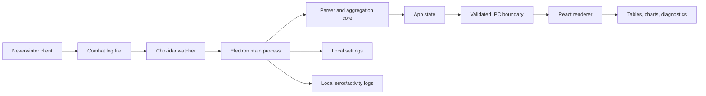
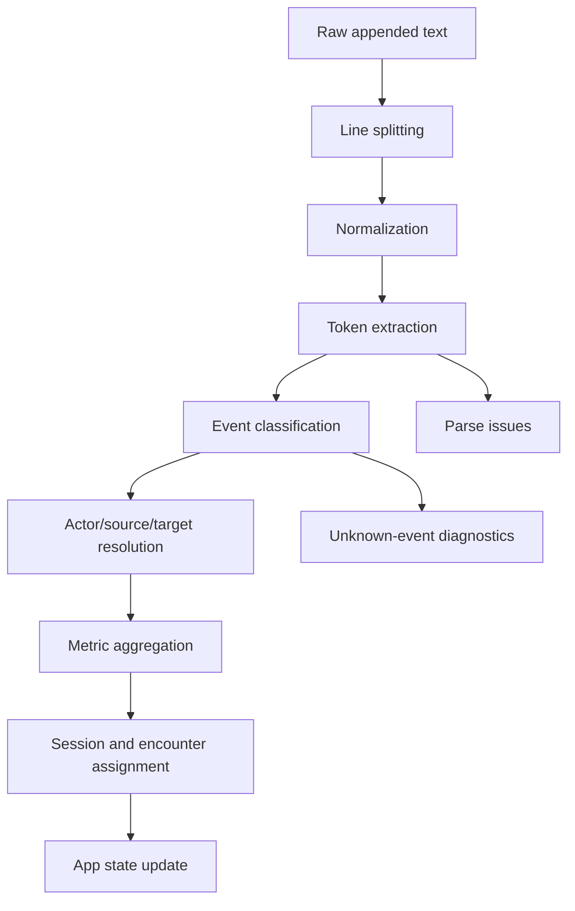

# Neverwinter Live Parser — Product and Engineering Case Study

> A comprehensive long-form case study for the Neverwinter Live Parser repository. This document is intentionally detailed so future maintainers, collaborators, portfolio reviewers, and AI coding agents can understand the product, desktop architecture, parser model, privacy stance, packaging workflow, and testing strategy without spelunking through every file like a doomed archaeologist with npm installed.

## Table of Contents

1. [Executive Summary](#executive-summary)
2. [Project Identity](#project-identity)
3. [Product Context](#product-context)
4. [Why Combat Logs Need a Real Product](#why-combat-logs-need-a-real-product)
5. [Target Users](#target-users)
6. [Primary Use Cases](#primary-use-cases)
7. [Product Principles](#product-principles)
8. [Feature Inventory](#feature-inventory)
9. [Desktop Architecture](#desktop-architecture)
10. [Runtime and Process Model](#runtime-and-process-model)
11. [Security and Privacy Model](#security-and-privacy-model)
12. [Combat Log Discovery](#combat-log-discovery)
13. [Live File Watching](#live-file-watching)
14. [Parser Pipeline](#parser-pipeline)
15. [Encounter and Session Modeling](#encounter-and-session-modeling)
16. [Metrics and Analysis Surfaces](#metrics-and-analysis-surfaces)
17. [Diagnostics and Unknown Events](#diagnostics-and-unknown-events)
18. [Recorded Log Review](#recorded-log-review)
19. [Local Persistence](#local-persistence)
20. [Windows Packaging](#windows-packaging)
21. [Development Workflow](#development-workflow)
22. [Testing Strategy](#testing-strategy)
23. [Fixture Strategy](#fixture-strategy)
24. [UX Architecture](#ux-architecture)
25. [Accessibility Strategy](#accessibility-strategy)
26. [Performance Strategy](#performance-strategy)
27. [Reliability Strategy](#reliability-strategy)
28. [Data Enrichment and NW-Hub Extraction](#data-enrichment-and-nw-hub-extraction)
29. [Risk Register](#risk-register)
30. [Maintenance Playbook](#maintenance-playbook)
31. [Release Checklist](#release-checklist)
32. [Roadmap](#roadmap)
33. [Portfolio Review Notes](#portfolio-review-notes)
34. [AI Coding Agent Notes](#ai-coding-agent-notes)
35. [Appendix A: Recommended Parser Contracts](#appendix-a-recommended-parser-contracts)
36. [Appendix B: Recommended IPC Contracts](#appendix-b-recommended-ipc-contracts)
37. [Appendix C: Manual QA Matrix](#appendix-c-manual-qa-matrix)
38. [Appendix D: Terminology](#appendix-d-terminology)
39. [Disclaimer](#disclaimer)

---

## Executive Summary

**Neverwinter Live Parser** is a Windows-first desktop application for monitoring and analyzing Neverwinter combat logs. It is built with Electron, React, TypeScript, Vite, Chokidar, Recharts, Electron Store, Vitest, and Electron Builder. The application is designed around a local-first privacy model: combat logs are read from the user’s machine, parsed locally, and presented through an Electron-powered desktop interface.

The parser supports two connected workflows:

1. **Live tracking** while a player is actively running content.
2. **Post-run review** of active or previously recorded combat logs.

The key product value is not merely displaying DPS. A serious combat parser must help players understand where output came from, which powers contributed, which targets were hit, which players took damage, how healing behaved, which encounters were measured, which events were ambiguous, and whether the parser’s assumptions are trustworthy.

This repository already includes a real Electron application, coordinated development scripts, TypeScript projects for renderer and main process work, Windows packaging scripts, local persistence, runtime hardening notes, NW-Hub extraction utilities, and a mature README. This case study expands the repository documentation into a deeper product and engineering map.

---

## Project Identity

| Attribute | Value |
|---|---|
| Product name | Neverwinter Live Parser |
| Repository | `Nischhalsubba/neverwinter-live-parser` |
| Product type | Local-first Windows desktop combat log parser |
| Runtime | Electron 35 |
| UI | React 19 |
| Language | TypeScript 5.8 |
| Build tool | Vite 6.3 |
| Packaging | Electron Builder 26 |
| Target platform | Windows x64 |
| Privacy model | Local-first |
| Distribution status | Active prototype, unsigned portable/unpacked builds |
| Maintainer | Nischhal Raj Subba / Archew identity in package metadata |

The app should be understood as an independent community tool. It is not an official Neverwinter application, not a game plugin, not a telemetry service, and not an upload-based parser website.

---

## Product Context

Neverwinter combat logs are plain local files created by the game client. They can contain detailed combat-event information, but raw logs are not pleasant to read. This will surprise absolutely nobody who has ever opened a giant timestamped text file and wondered whether their life choices led them there.

Players often want answers such as:

- who did the most damage
- which powers produced the most output
- which targets received damage
- how much healing happened
- how much damage each player took
- when a fight started and ended
- whether companions, artifacts, or support effects contributed
- whether the parser missed lines during log rotation
- whether a run can be reviewed later
- whether encounter-level data differs from session-level data

Raw logs are rich, but they are not a product. A product has to convert file events into useful mental models: sessions, encounters, actors, powers, targets, metrics, tables, charts, warnings, and summaries.

---

## Why Combat Logs Need a Real Product

A combat log parser can fail in two broad ways:

1. It can fail technically by missing lines, duplicating lines, crashing on malformed events, or losing state when a new file appears.
2. It can fail as a product by showing numbers with no explanation, hiding uncertainty, confusing encounter scopes, or making users trust output that should still be verified.

Neverwinter Live Parser is designed around both problems.

### The technical challenge

The app must watch files while they change, detect new combat logs, read appended content safely, parse event lines, classify events, aggregate metrics, send updates across the Electron IPC boundary, and keep the renderer responsive.

### The product challenge

The app must explain what it knows, what it inferred, what it ignored, what it could not parse, and how the numbers should be interpreted. A single DPS table can be useful, but it is not enough. Combat analysis needs context.

### The trust challenge

Parser output must be treated as useful but not magical. Logs may be incomplete. Event formats may change. Encounter boundaries can be inferred incorrectly. Some events may be unknown. If the parser pretends every number is perfect, it becomes another confident machine making humans worse at thinking. We already have enough of those.

---

## Target Users

### 1. Endgame DPS players

DPS players want to inspect output, compare powers, review target focus, and understand performance across encounters.

Needs:

- reliable damage totals
- power breakdowns
- target breakdowns
- encounter-level data
- post-run review
- ability to compare multiple pulls

### 2. Support players

Support players need to understand how support windows, artifacts, buffs, debuffs, companions, or group effects influence performance.

Needs:

- visibility into support-related event categories
- separation of player, companion, artifact, and auxiliary events
- diagnostics for events that are difficult to classify
- timeline or window-based review in future versions

### 3. Tanks and healers

Tanks and healers need analysis beyond raw DPS.

Needs:

- healing totals
- damage taken
- incoming damage sources
- target and encounter segmentation
- survival and mitigation-oriented review

### 4. Party leaders

Party leaders need to compare team-level output and identify issues during runs.

Needs:

- party rankings
- encounter summaries
- session history
- exportable or shareable summaries in future versions
- clear distinction between current encounter and whole session

### 5. Parser maintainers

Maintainers need reproducible test fixtures, diagnostic logs, unknown-event handling, and clear architecture.

Needs:

- clear parser contracts
- fixture strategy
- unknown line reporting
- release checks
- packaging notes
- security boundaries

### 6. Portfolio reviewers

Portfolio reviewers need to see product thinking, desktop architecture, secure Electron patterns, and evidence that the project handles complexity responsibly.

Needs:

- clear problem framing
- architecture map
- risk register
- testing strategy
- product roadmap
- honest limitations

---

## Primary Use Cases

### Use Case 1: Live dungeon tracking

A player launches the desktop app, selects or discovers the active Neverwinter combat-log folder, starts a dungeon, and watches the parser update as the log grows.

Expected behavior:

- active file is detected
- new lines are read without duplicating previous lines
- current session updates
- current encounter updates where segmentation is supported
- tables and charts update without freezing the UI
- unknown events are logged diagnostically, not allowed to crash the app

### Use Case 2: New combat log appears

Neverwinter creates a new file after a client restart, date change, relog, or fresh logging session.

Expected behavior:

- app detects candidate log files
- latest file can be selected or followed
- old session history is preserved
- new file does not erase previous analysis without user understanding
- diagnostics show which file is active

### Use Case 3: Post-run review

A player opens a recorded combat log after the run ends.

Expected behavior:

- file can be parsed without needing live growth
- session and encounter summaries become available
- player/power/target breakdowns can be inspected
- malformed or unknown lines are surfaced safely

### Use Case 4: Parser debugging

A maintainer loads a representative log and reviews unknown events, parse issues, auxiliary events, and raw-line diagnostics.

Expected behavior:

- unknown events are collected
- parse issues have enough context for debugging
- sensitive local paths are not leaked unnecessarily
- fixtures can be created from anonymized samples

### Use Case 5: Packaged local usage

A user runs the unpacked or portable Windows build.

Expected behavior:

- app launches without development server
- runtime uses packaged assets
- no unexpected outbound requests occur
- file selection and watching work
- unsigned build warnings are documented

---

## Product Principles

### 1. Local-first by default

Combat logs should stay on the user’s device. A desktop parser does not need to upload logs to a remote server simply to summarize them.

### 2. Explain uncertainty

Encounter segmentation and event classification can be difficult. Unknown or ambiguous data should be reported instead of forced into false certainty.

### 3. Separate useful scopes

Session-level totals and encounter-level totals answer different questions. The UI should not collapse them into one confusing number soup.

### 4. Keep live updates readable

A live parser should not flicker, jump, or constantly rearrange the interface in a way that punishes the user for watching it.

### 5. Treat logs as untrusted input

Imported or selected log files are local, but they are still input. The parser should guard against malformed, huge, truncated, or unexpected files.

### 6. Keep desktop security boundaries strong

The Electron main process should own file-system access. The renderer should not receive arbitrary privileged access just because JavaScript asked nicely, which is how many bad Electron apps begin their tragic little biography.

### 7. Optimize for maintainability

Combat log parsing evolves. The app needs contracts, fixtures, diagnostics, and documentation so future parser work does not become folklore.

---

## Feature Inventory

| Feature | Current / Intended Role | Notes |
|---|---|---|
| Electron desktop shell | Local Windows runtime | Main process handles privileged behavior |
| React renderer | User interface | Displays dashboards, tables, charts, states |
| Chokidar file watching | Live log tracking | Watches combat-log growth and file changes |
| Session preservation | Maintains historical context | Important when log files rotate |
| Encounter analysis | Scopes combat activity | Requires careful inference |
| Player rankings | Compares combatants | Must reconcile with encounter/session scope |
| Power breakdowns | Explains output sources | Helps players review rotations and abilities |
| Target breakdowns | Shows target focus | Helps identify boss/trash split and priorities |
| Healing analysis | Tracks recovery output | Important for support and healer review |
| Damage-taken analysis | Tracks incoming damage | Important for tank and survivability review |
| Diagnostics | Unknown events and parse issues | Essential for parser maintenance |
| Local settings | Remembers selected folder | Settings stored locally |
| Runtime hardening | Blocks risky Electron behavior | Documented in `SECURITY.md` |
| Windows packaging | Portable/unpacked builds | Unsigned builds may trigger warnings |
| NW-Hub extraction | Class/artifact data enrichment | Requires licensing and provenance review |
| Automated checks | Typecheck, tests, build | Used by `npm run check` |

---

## Desktop Architecture

Neverwinter Live Parser uses a split desktop architecture:

- **Electron main process** for privileged system behavior
- **React renderer** for user-facing interaction
- **Parser/core logic** for reading and interpreting combat data
- **Shared types** for contracts across process boundaries



### Why this architecture works

The main process owns the dangerous parts: file paths, file reads, watcher lifecycle, dialogs, runtime settings, and app packaging behavior. The renderer owns presentation: dashboards, controls, charts, lists, diagnostics, and user workflows.

This separation matters because Electron apps become risky when the renderer can freely reach into the user’s file system. Here, the main process creates a controlled bridge. The renderer gets structured state, not a skeleton key to the disk.

---

## Runtime and Process Model

### Development mode

The development script starts three coordinated processes:

1. Vite renderer server
2. TypeScript watcher for Electron main code
3. Electron shell after required outputs are ready

This is coordinated by `concurrently` and `wait-on`.

```powershell
npm run dev
```

This command maps to:

- `npm run dev:renderer`
- `npm run dev:main`
- `npm run dev:electron`

### Production mode

Production build compiles the renderer and Electron main process:

```powershell
npm run build
```

Packaged builds are produced by Electron Builder:

```powershell
npm run dist:win-unpacked
npm run dist:win-portable
```

### Runtime path strategy

The Electron main process configures runtime paths under a temp directory in development and production runtime contexts. It sets separate user-data, session-data, and cache paths. This reduces issues with locked or synchronized Windows folders and avoids cache collisions during rapid development restarts.

This is the kind of boring runtime detail that prevents thrilling bug reports like “it only breaks after the third restart on Tuesday.”

---

## Security and Privacy Model

The repository’s security notes document several important hardening choices:

- `nodeIntegration` is disabled
- `contextIsolation` is enabled
- permission requests are denied
- webviews are blocked
- arbitrary navigation is blocked
- popup windows are denied
- automatic outbound web requests are blocked in the packaged runtime
- single-instance behavior is enforced
- logs are read locally
- parser state stays local
- error logs are stored locally

### Security objectives

1. Keep combat log access local and explicit.
2. Avoid renderer-side privileged file access.
3. Block arbitrary navigation and popups.
4. Avoid undocumented network behavior.
5. Treat imported logs as untrusted input.
6. Avoid exposing local paths or personal information in public diagnostics.

### Privacy boundaries

Combat logs may include character names, party details, account-adjacent context, local file paths, or gameplay behavior. Even if this data does not feel sensitive to every player, the product should treat it carefully.

Recommended privacy rules:

- Do not upload logs by default.
- Do not add analytics without explicit disclosure.
- Do not include full local paths in shared reports by default.
- Do not send unknown lines to a remote service automatically.
- Do not log account identifiers.
- Do not publish user-submitted logs without anonymization.

### Distribution security

Unsigned Windows executables may trigger SmartScreen or Smart App Control. That is a reputation and distribution trust issue, not proof that the app is malicious. Still, for wider public releases, code signing and checksums are important.

---

## Combat Log Discovery

Combat logs follow a recognizable filename pattern such as:

```text
combatlog_YYYY-MM-DD_HH-MM-SS.log
```

or in some cases:

```text
combatlog_YYYY-MM-DD_HH-MM-SS.txt
```

The app includes logic to parse timestamps from combat-log filenames and to scan available drives for candidate files or folders. This supports a friendlier first-run experience, especially for users who do not remember where their game client writes logs.

### Discovery goals

- find likely combat-log folders
- identify the newest combat log
- allow manual selection when discovery fails
- keep selected folder settings local
- avoid scanning too aggressively
- never silently parse unrelated files

### Discovery risks

| Risk | Mitigation |
|---|---|
| Slow drive scanning | Limit search depth and candidates |
| Permission errors | Surface clear diagnostics |
| False positives | Require matching filename pattern |
| Multiple installs | Show candidate list with timestamps |
| Network/synced folders | Prefer explicit user selection |

---

## Live File Watching

Live parsing depends on safe file watching. The parser must detect appended lines without duplicating old content or missing new content.

### Watcher responsibilities

- monitor active log file changes
- handle file growth
- handle new log creation
- avoid rereading the whole file when only new lines were appended
- preserve previous sessions
- report missing-path or permission failures
- safely stop and restart watchers when settings change

### File-watching edge cases

1. The game creates a new log while the app is running.
2. The user selects a folder with no matching logs.
3. The file grows quickly during heavy combat.
4. The file is truncated or replaced.
5. The app loses permission to read the file.
6. The user switches selected folder mid-session.
7. The file is huge from long play sessions.
8. The app starts after a log already contains many lines.

### Watcher product rule

The user should always know which file is active. A parser that watches the wrong file with great confidence is just a spreadsheet with a trench coat.

---

## Parser Pipeline

A robust parser pipeline should be explicit and staged.



### Stage 1: Raw line handling

Responsibilities:

- split appended text into complete lines
- preserve incomplete trailing line until complete
- normalize line endings
- ignore empty lines safely
- guard against extremely long lines

### Stage 2: Token extraction

Responsibilities:

- extract timestamp where available
- extract source actor
- extract target actor
- extract power or effect name
- extract amount
- extract flags such as critical, combat advantage, mitigation, healing, shield, or auxiliary events where supported

### Stage 3: Event classification

Potential event categories:

- damage
- healing
- damage taken
- shielding
- absorption
- companion/pet event
- artifact event
- buff/debuff event
- death/defeat event
- auxiliary/system event
- unknown event

### Stage 4: Aggregation

Aggregation should produce:

- per-player totals
- per-power totals
- per-target totals
- encounter totals
- session totals
- timeline buckets where needed
- unknown-event counts
- parse-issue counts

### Stage 5: UI state update

The renderer should receive structured summaries, not raw parser internals. This protects UI stability and keeps the parser replaceable.

---

## Encounter and Session Modeling

### Session

A session represents a broader log-analysis period. It may include multiple pulls, bosses, dungeon sections, deaths, trash packs, and downtime.

Recommended session fields:

```ts
type ParsedSession = {
  id: string;
  logFilePath: string;
  startedAt?: number;
  endedAt?: number;
  encounters: EncounterSummary[];
  totals: CombatTotals;
  diagnostics: ParserDiagnostics;
};
```

### Encounter

An encounter is a meaningful combat scope. It may represent a boss fight, trash pull, dungeon phase, or inferred combat window.

Recommended encounter fields:

```ts
type EncounterSummary = {
  id: string;
  name: string;
  startedAt: number;
  endedAt?: number;
  confidence: "high" | "medium" | "low";
  classification: "boss" | "trash" | "mixed" | "unknown";
  participants: CombatantSummary[];
  targets: TargetSummary[];
  diagnostics: ParserDiagnostics;
};
```

### Encounter-confidence rule

Encounter boundaries are often inferred. The UI should avoid pretending that every encounter boundary is exact. Confidence labels are better than fake certainty. Tiny labels, huge trust benefit. Truly radical stuff.

---

## Metrics and Analysis Surfaces

### Core metrics

| Metric | Why it matters |
|---|---|
| Total damage | Basic output comparison |
| DPS | Output normalized by active time |
| Power contribution | Shows which abilities produced value |
| Target breakdown | Shows boss/trash focus and target selection |
| Healing | Supports healer and support review |
| Damage taken | Supports tank and survival review |
| Critical/combat-advantage flags | Helps interpret output quality |
| Companion/pet contribution | Separates player actions from auxiliary sources |
| Artifact/support contribution | Helps explain support value |
| Unknown-event count | Indicates parser coverage quality |
| Parse issues | Helps maintain parser reliability |

### Analysis surfaces

A complete UI should provide:

- overview cards
- player ranking tables
- power breakdown tables
- target breakdown tables
- encounter list
- session archive
- recorded log imports
- diagnostics panel
- charts for trends and comparisons
- settings for log folder and parser behavior

### Important product distinction

Tables answer exact comparison questions. Charts answer pattern questions. Forcing every analytical idea into a chart is how dashboards become expensive abstract art.

---

## Diagnostics and Unknown Events

Unknown events are not merely errors. They are product feedback. They tell the maintainer where the parser’s understanding is incomplete.

### Diagnostic categories

| Category | Meaning |
|---|---|
| Unknown event | Line was readable but not classified |
| Malformed line | Line did not match expected structure |
| Incomplete line | File append ended mid-line |
| Unsupported actor type | Source/target form is not modeled yet |
| Unsupported metric | Event is recognized but not measured yet |
| File read issue | Permission, missing file, or IO failure |
| Watcher issue | Chokidar or file-rotation state problem |
| Renderer issue | UI failed to render or consume state |

### Diagnostic display rules

- Show counts in the UI.
- Keep raw samples available locally for debugging.
- Avoid exposing sensitive local paths in shareable views.
- Provide enough context to build fixtures.
- Do not crash on unknown lines.

Unknown lines should be treated like a backlog, not a disgrace. A parser that logs uncertainty is already more honest than half the dashboards on Earth.

---

## Recorded Log Review

Live parsing is only one workflow. Recorded-log review matters because users often want to inspect a run after it ends.

### Recorded-review goals

- open an existing combat log
- parse the file without requiring live growth
- preserve session and encounter summaries
- allow repeated debugging on the same fixture
- support historical comparisons in future versions

### Recorded-review risks

| Risk | Why it matters | Mitigation |
|---|---|---|
| Huge file size | Can block UI or memory | Stream parsing and progress states |
| Malformed old logs | Parser assumptions may fail | Defensive parsing and diagnostics |
| Patch differences | Event format/value meaning may differ | Add patch/source context where possible |
| Privacy | Logs may include names | Local-only by default, anonymized fixtures |

---

## Local Persistence

The app uses local settings and state so users do not need to reconfigure everything every launch.

### Stored settings

Currently documented settings include selected log folder behavior. Future settings may include:

- preferred combat-log folder
- recent logs
- display preferences
- metric defaults
- privacy options
- diagnostic verbosity
- compact mode preferences

### Persistence rule

Local settings are for convenience, not for sensitive secrets. Combat logs should not be uploaded or synced unless a future feature clearly asks the user and explains what leaves the device.

### Clear data behavior

The app includes settings cleanup behavior. Clear-data workflows should remove local selections and cached app state without damaging original combat logs.

---

## Windows Packaging

The repository supports Windows package targets through Electron Builder.

### Unpacked build

```powershell
npm run dist:win-unpacked
```

Expected output:

```text
release/win-unpacked/Neverwinter Live Parser.exe
```

### Portable build

```powershell
npm run dist:win-portable
```

Expected output pattern:

```text
release/Neverwinter-Live-Parser-Portable-0.1.0.exe
```

### Packaging notes

- Target platform is Windows x64.
- Code signing is not configured.
- SmartScreen or Smart App Control may warn on unsigned builds.
- Public releases should include checksums.
- Public releases should include release notes.
- Users should be told the app is local-first and unsigned if applicable.

### Recommended release artifacts

| Artifact | Purpose |
|---|---|
| Portable `.exe` | Easy test distribution |
| Unpacked folder | Repeated local use and debugging |
| SHA256 checksum | Integrity verification |
| Release notes | Scope and known issues |
| Security notes | Trust and local-first disclosure |

---

## Development Workflow

### Install

```powershell
npm install
```

### Run development app

```powershell
npm run dev
```

### Typecheck

```powershell
npm run typecheck
```

### Test

```powershell
npm run test
```

### Build

```powershell
npm run build
```

### Full check

```powershell
npm run check
```

### Development behavior

The development environment coordinates renderer, main-process TypeScript, and Electron startup. This prevents the Electron shell from launching before the renderer server or compiled main entry is ready.

### Maintainer warning

Do not bypass the main-process bridge by giving the renderer direct file-system powers. That path is seductive, convenient, and exactly how desktop apps become a security incident with icons.

---

## Testing Strategy

Testing should focus on parser correctness, desktop reliability, and UI interpretation.

### Unit tests

High-value unit tests:

- line tokenizer
- timestamp extraction
- damage event parsing
- healing event parsing
- damage-taken parsing
- actor normalization
- target normalization
- unknown-event classification
- malformed-line handling
- DPS calculation
- encounter duration calculation
- duplicate-line prevention
- file-rotation logic

### Integration tests

High-value integration tests:

- parse representative log fixture
- aggregate session totals
- aggregate encounter totals
- preserve history across new file events
- import recorded log
- produce diagnostics for unknown lines
- reconcile table totals and chart data

### Desktop tests

Manual or automated desktop tests:

- app launch in dev mode
- app launch unpacked
- app launch portable
- folder selection dialog
- missing folder state
- denied permission state
- watcher restart after folder change
- single-instance behavior
- blocked navigation behavior
- no unexpected outbound requests

---

## Fixture Strategy

Parser quality depends on fixtures. Without fixtures, parser development becomes “try this one random log and hope the universe approves.” Inspirational, but bad engineering.

### Fixture categories

| Fixture | Purpose |
|---|---|
| Small direct-damage log | Basic parser sanity |
| Long dungeon log | Performance and session review |
| Boss-only log | Encounter segmentation |
| Trash-heavy log | Target classification |
| Healer-focused log | Healing metrics |
| Tank damage-taken log | Incoming damage metrics |
| Companion/pet log | Auxiliary source handling |
| Artifact/support log | Support-effect handling |
| Malformed-line log | Defensive parsing |
| File-rotation fixture | Watcher behavior |
| Huge log | Performance and memory |

### Fixture privacy rules

- Anonymize player names when possible.
- Remove account-adjacent identifiers.
- Avoid publishing private group logs without permission.
- Keep raw full logs out of public fixtures unless permission is clear.
- Prefer reduced representative samples.

### Fixture metadata

Each fixture should include:

- date collected
- game patch if known
- content type
- expected parser behavior
- anonymization status
- known limitations

---

## UX Architecture

A parser UI must support both live monitoring and investigation.

### Suggested layout model

| Region | Purpose |
|---|---|
| Header/status bar | Active file, watcher status, current session |
| Left navigation | Sessions, encounters, recorded logs |
| Main dashboard | Summary cards, rankings, charts |
| Detail panel | Selected player, power, target, or diagnostic details |
| Footer/status strip | parse issues, unknown events, memory/CPU state where useful |

### Key UX states

- first-run setup
- no folder selected
- folder selected but no logs found
- active file detected
- live parsing active
- recorded log loaded
- permission error
- malformed log warning
- watcher stopped
- parser error
- empty encounter
- unknown-event warning
- packaged unsigned build notice

### UX principle

Every empty or error state should teach the user what to do next. “No data” is not a message; it is a tiny shrug wearing UI text.

---

## Accessibility Strategy

### Desktop keyboard behavior

A Windows desktop tool should support keyboard usage for:

- selecting sessions
- moving through encounter lists
- switching table rows
- opening detail panels
- closing dialogs
- choosing folders
- running imports
- copying diagnostics

### Focus management

Focus must be visible and predictable. Dialogs and drawers should trap focus while open and restore focus when closed.

### Tables

Tables should support:

- clear headers
- sortable columns where implemented
- readable numeric alignment
- accessible labels for abbreviations
- row focus states
- non-color indicators for warnings

### Motion

Charts and transitions should respect reduced-motion preferences. Live updates should not produce constant layout shifting.

### Text

Combat metrics should be explained in plain language. Not every player knows how a parser defines active time, encounter duration, or DPS. If the app defines those terms clearly, it saves Discord from at least four arguments per week. A public service, really.

---

## Performance Strategy

### Performance risks

| Risk | Why it matters |
|---|---|
| Huge logs | Can consume memory and block parsing |
| Frequent file writes | Can trigger excessive UI updates |
| Large tables | Can slow renderer performance |
| Chart rerenders | Can become expensive during live updates |
| Full-file rereads | Wasteful and risks duplicate parsing |
| Unknown-line accumulation | Diagnostics can grow without bounds |
| Electron overhead | Desktop runtime has baseline cost |

### Mitigation strategies

- read appended chunks instead of whole files where possible
- batch UI updates
- debounce or throttle live renderer updates
- cap diagnostic samples
- aggregate incrementally
- virtualize large tables if needed
- avoid expensive derived calculations inside render loops
- keep parser logic outside React components
- measure memory and CPU during long sessions

### Runtime telemetry

The main process includes CPU and memory usage sampling. This can support diagnostics and help identify runaway parsing, memory growth, or expensive UI loops.

---

## Reliability Strategy

### Reliability goals

- App should not crash on bad lines.
- Watcher should recover when files rotate.
- Renderer should remain responsive during active parsing.
- Settings corruption should fall back gracefully.
- Missing folders should show helpful states.
- Parser failures should become diagnostics.

### Defensive parsing principles

1. Treat every line as untrusted.
2. Prefer partial parsing over crashing.
3. Keep raw samples for unknown events locally.
4. Separate parse issues from product metrics.
5. Never let one malformed line destroy a session.
6. Keep parser contracts typed and tested.

### Reliability smell list

Watch for these signs:

- totals differ between table and chart
- DPS changes wildly after encounter end
- old lines are counted twice
- new log file erases history
- unknown events silently disappear
- parser ignores healing or pet events
- packaged app behaves differently from dev
- renderer has direct file-system access

---

## Data Enrichment and NW-Hub Extraction

The repository includes scripts for extracting class and artifact data:

```powershell
npm run extract:nwhub
npm run extract:nwhub:artifacts
```

### Purpose

These scripts can support enrichment of parser output by mapping game entities to class, artifact, or reference metadata.

### Caution

Extracted content should be reviewed before public redistribution. Source licensing, attribution, freshness, and accuracy must be considered.

### Recommended enrichment fields

```ts
type GameEntityReference = {
  id: string;
  name: string;
  category: "class" | "artifact" | "companion" | "power" | "mount" | "unknown";
  sourceUrl?: string;
  sourceName?: string;
  extractedAt?: string;
  verifiedAt?: string;
  verificationStatus: "verified" | "partial" | "unverified" | "stale";
  notes?: string;
};
```

### Enrichment rule

Reference enrichment should clarify parser output, not become a hidden dependency that makes logs impossible to understand without external data.

---

## Risk Register

| Risk | Severity | Why it matters | Mitigation |
|---|---:|---|---|
| Parser misclassifies events | High | Users trust wrong metrics | Fixtures, diagnostics, verification labels |
| Duplicate line parsing | High | Inflates totals | Track offsets and line IDs |
| Missed live updates | High | Live analysis becomes unreliable | Watcher tests and file-rotation handling |
| Encounter boundary errors | Medium | Wrong encounter totals | Confidence labels and manual review |
| Huge logs degrade performance | Medium | UI freezes or memory grows | Incremental parsing and batching |
| Renderer gets privileged access | High | Security issue | Keep file access in main process |
| Unsigned Windows builds | Medium | User trust warnings | Code signing, checksums, release notes |
| Unknown events ignored | Medium | Parser coverage never improves | Diagnostics and fixture backlog |
| Personal data in logs | High | Privacy risk | Local-first, anonymization, no uploads by default |
| External source licensing | Medium | Redistribution risk | Review NW-Hub extraction provenance |
| Network requests in packaged app | High | Privacy trust issue | Block and document outbound behavior |
| Settings corruption | Low | App loses folder selection | Default settings fallback |

---

## Maintenance Playbook

### Updating parser patterns

1. Add or identify a representative log sample.
2. Add a reduced anonymized fixture.
3. Write expected output.
4. Update parser pattern logic.
5. Add unknown-event tests.
6. Run `npm run check`.
7. Review UI totals against fixture expectations.
8. Update documentation if the metric definition changes.

### Adding a new metric

1. Define the metric contract.
2. Add parser extraction support.
3. Add aggregation support.
4. Add UI display rules.
5. Add tests.
6. Add tooltip/explanation copy.
7. Verify table/chart reconciliation.
8. Update README or case study if the metric is major.

### Changing IPC behavior

1. Define or update shared types.
2. Validate input at the main-process boundary.
3. Avoid exposing raw file-system operations to the renderer.
4. Keep channel names clear and scoped.
5. Update tests or manual QA.
6. Review security notes.

### Changing packaging

1. Build unpacked target.
2. Build portable target.
3. Launch both on a clean Windows machine.
4. Confirm selected-folder behavior.
5. Confirm watcher behavior.
6. Confirm no undocumented network requests.
7. Confirm release artifact names.
8. Generate checksums.
9. Write release notes.

---

## Release Checklist

```powershell
npm ci
npm run check
npm run dist:win-unpacked
npm run dist:win-portable
```

Manual verification:

- [ ] app launches in development mode
- [ ] renderer loads without console errors
- [ ] Electron main process compiles
- [ ] typecheck passes
- [ ] Vitest passes
- [ ] production build completes
- [ ] unpacked application launches
- [ ] portable executable launches
- [ ] folder selection works
- [ ] active combat log is detected
- [ ] live appended lines update the UI
- [ ] new combat log creation is handled
- [ ] previous session history remains accessible
- [ ] recorded log review works
- [ ] unknown lines do not crash the app
- [ ] missing folder state is helpful
- [ ] permission error state is helpful
- [ ] charts and tables reconcile
- [ ] no unexpected outbound requests are observed
- [ ] unsigned-build warning is documented
- [ ] release notes mention known parser limitations

---

## Roadmap

### Near-term parser work

- Expand combat-line pattern coverage.
- Add more fixtures for real dungeon and trial logs.
- Improve unknown-event diagnostics.
- Strengthen companion and pet classification.
- Improve boss/trash segmentation.
- Add clearer active-time and DPS definitions.

### Near-term product work

- Improve first-run folder setup.
- Add clearer selected-file state.
- Improve session and encounter navigation.
- Add better empty and error states.
- Add exportable text or CSV summaries.
- Improve accessibility and keyboard navigation.

### Mid-term engineering work

- Add file-offset persistence.
- Add fixture-based parser regression suite.
- Add table/chart reconciliation tests.
- Add smoke tests for packaged builds.
- Add release checksums.
- Add automated release workflow.

### Long-term product work

- Add optional overlay or compact mode.
- Add boss-phase timelines.
- Add combat replay timeline.
- Add support-window detection.
- Add local report library.
- Add anonymized export mode.
- Add encounter comparison.
- Add Discord-friendly summaries.

### Long-term distribution work

- Code-sign Windows builds.
- Publish release notes and checksums.
- Document upgrade behavior.
- Add installer target if needed.
- Add user-facing privacy page.

---

## Portfolio Review Notes

This project is strong as a portfolio case study because it demonstrates more than screen design. It shows:

- desktop runtime thinking
- security-conscious Electron architecture
- local-first product strategy
- parser and data-modeling complexity
- live file-watching behavior
- Windows packaging awareness
- diagnostics and uncertainty handling
- analytical UI thinking
- practical gaming-domain product design

### Portfolio angles

| Angle | Evidence |
|---|---|
| Product design | Live tracking and post-run review workflows |
| Technical UX | File states, diagnostics, sessions, encounters |
| Engineering judgment | Main/renderer separation and hardening choices |
| Data modeling | Parser events, actors, powers, targets, metrics |
| Privacy | Local-first combat-log handling |
| Reliability | Unknown events, parse issues, packaging checks |
| Documentation | README, security notes, this case study |

### How to describe it in a portfolio

> Designed and built a Windows-first desktop combat log parser for Neverwinter using Electron, React, TypeScript, and Vite. The project watches local combat logs, parses live and recorded sessions, organizes encounters, surfaces player/power/target metrics, preserves local privacy, and packages into Windows desktop artifacts. The product focuses on trustworthy analysis, parser diagnostics, and local-first workflows rather than upload-based parsing.

---

## AI Coding Agent Notes

Future AI agents working in this repo should follow these rules, because apparently we now have to leave instructions for the synthetic interns too.

### Inspect first

Before changing parser behavior, inspect:

1. `README.md`
2. `SECURITY.md`
3. `package.json`
4. `tsconfig.electron.json`
5. `src/main/`
6. `src/core/`
7. `src/shared/`
8. renderer components that consume parser state
9. tests and fixtures

### Do not assume

Do not assume:

- every combat line is damage
- every source is a player
- every target is an enemy
- every encounter boundary is obvious
- every log uses the same format forever
- every package build behaves like development
- every unknown event can be ignored

### Make small changes

Parser changes should be small, fixture-backed, and documented. A huge parser rewrite without fixtures is not bravery. It is just entropy with a pull request number.

### Preserve security boundaries

Never give the renderer arbitrary file access. Keep privileged behavior in the main process and validate IPC messages.

### Preserve privacy

Do not add telemetry, uploads, external diagnostics, or remote unknown-line reporting without explicit user-facing documentation and opt-in behavior.

---

## Appendix A: Recommended Parser Contracts

### Raw event

```ts
type RawCombatLine = {
  lineNumber?: number;
  offsetStart?: number;
  offsetEnd?: number;
  text: string;
  receivedAt: number;
};
```

### Parsed event

```ts
type ParsedCombatEvent = {
  id: string;
  timestamp?: number;
  category:
    | "damage"
    | "healing"
    | "damage_taken"
    | "shield"
    | "absorb"
    | "buff"
    | "debuff"
    | "death"
    | "system"
    | "unknown";
  source?: CombatActor;
  target?: CombatActor;
  power?: CombatPower;
  amount?: number;
  flags?: CombatEventFlags;
  rawLine?: string;
  confidence: "high" | "medium" | "low";
};
```

### Combat actor

```ts
type CombatActor = {
  id: string;
  displayName: string;
  kind: "player" | "companion" | "pet" | "enemy" | "artifact" | "environment" | "unknown";
  ownerId?: string;
};
```

### Combat totals

```ts
type CombatTotals = {
  damage: number;
  healing: number;
  damageTaken: number;
  activeDurationMs: number;
  dps: number;
  hps?: number;
};
```

### Parser diagnostics

```ts
type ParserDiagnostics = {
  unknownEvents: UnknownEventSample[];
  parseIssues: ParseIssue[];
  malformedLineCount: number;
  ignoredLineCount: number;
  lastParsedOffset?: number;
};
```

---

## Appendix B: Recommended IPC Contracts

### Channel principles

- Channel names should be explicit.
- Requests should validate payloads.
- Responses should use typed success/error shapes.
- Renderer should never pass arbitrary paths into unrestricted filesystem operations.
- Main process should own dialogs and path validation.

### Example response envelope

```ts
type IpcResult<T> =
  | { ok: true; data: T }
  | { ok: false; error: { code: string; message: string; recoverable: boolean } };
```

### Suggested channels

| Channel | Direction | Purpose |
|---|---|---|
| `settings:read` | renderer → main | Load local settings |
| `settings:update` | renderer → main | Update selected folder/preferences |
| `log-folder:choose` | renderer → main | Open folder picker |
| `logs:discover` | renderer → main | Discover candidate combat logs |
| `monitor:start` | renderer → main | Start watching selected log/folder |
| `monitor:stop` | renderer → main | Stop watching |
| `monitor:state` | main → renderer | Push parser state |
| `diagnostics:read` | renderer → main | Read local diagnostics |
| `diagnostics:clear` | renderer → main | Clear local diagnostics |

---

## Appendix C: Manual QA Matrix

| Area | Test | Expected result |
|---|---|---|
| Startup | Launch dev app | Renderer and Electron shell start |
| Startup | Launch unpacked build | App opens without dev server |
| Startup | Launch portable build | App opens and creates local runtime data |
| Single instance | Open app twice | Second launch focuses/does not duplicate app |
| Folder setup | Select valid log folder | Candidate logs are detected |
| Folder setup | Select empty folder | Helpful empty state appears |
| Folder setup | Select restricted folder | Permission warning appears |
| Live watch | Append line to active log | UI updates once |
| Live watch | Append many lines quickly | UI remains responsive |
| Rotation | Create newer combat log | App detects or offers new candidate |
| History | New log appears | Old session remains accessible |
| Parser | Load direct damage fixture | Damage totals match expected |
| Parser | Load healing fixture | Healing totals match expected |
| Parser | Load malformed fixture | Diagnostics appear, app does not crash |
| UI | Sort player table | Sorting works and remains readable |
| UI | Select player | Detail panel updates |
| UI | Select encounter | Metrics scope changes |
| Diagnostics | Unknown events exist | Count and samples are available |
| Security | Attempt external navigation | Navigation is blocked |
| Security | Popup attempt | Popup is denied |
| Privacy | Share diagnostics | Full local path is not exposed by default |
| Packaging | Build portable | Artifact matches expected naming pattern |

---

## Appendix D: Terminology

| Term | Meaning |
|---|---|
| Combat log | Local file written by Neverwinter containing combat events |
| Live parsing | Reading new log lines as the file changes |
| Recorded review | Parsing an existing log after play ends |
| Session | Broad analysis period from a log or run |
| Encounter | Smaller combat scope such as boss, pull, or phase |
| Actor | Source or target of an event |
| Power | Ability, attack, heal, artifact effect, or related named action |
| DPS | Damage per second over a defined duration |
| HPS | Healing per second over a defined duration |
| Unknown event | Log line the parser could not classify |
| Parse issue | Line or token problem encountered during parsing |
| Auxiliary event | Support, companion, artifact, or non-core event category |
| IPC | Inter-process communication between Electron main and renderer |
| Renderer | React UI process |
| Main process | Electron privileged process |
| Portable build | Single executable package produced by Electron Builder |
| Unpacked build | Directory-based packaged Windows application |

---

## Disclaimer

Neverwinter Live Parser is an independent community project. It is not affiliated with, endorsed by, sponsored by, or officially connected to Cryptic Studios, Arc Games, Gearbox Publishing, Wizards of the Coast, or any Neverwinter rights holder. Game names, terminology, data, and related intellectual property belong to their respective owners.

This parser should be treated as a local analysis aid, not as an official source of truth. Combat-log interpretation can be affected by parser bugs, incomplete fixtures, game updates, malformed logs, and inferred encounter boundaries. Always validate important results against representative logs and current game behavior before treating them as authoritative.
